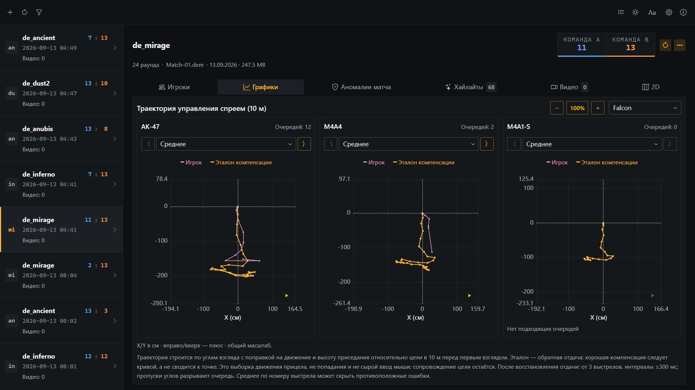
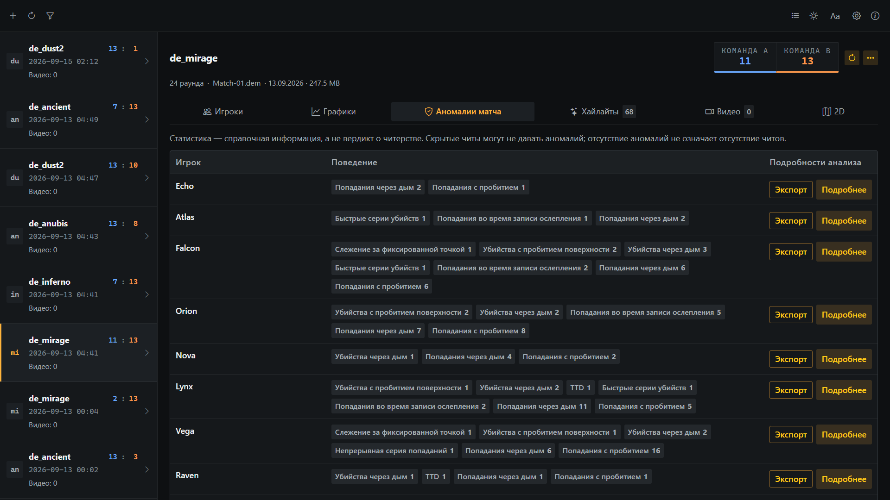
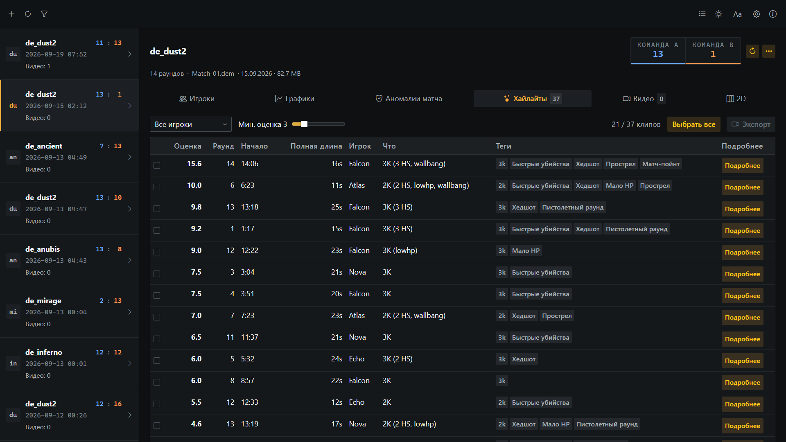
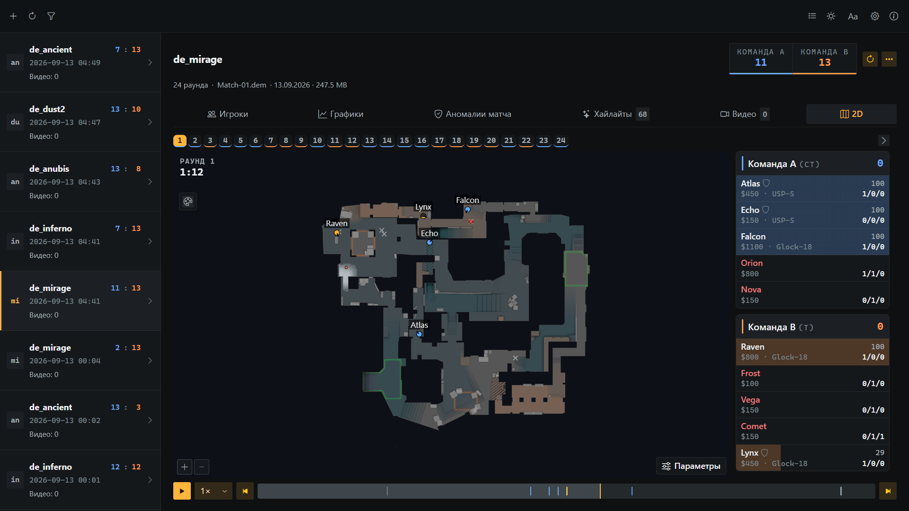

# CS DemoDesk

[English](README.md) | [繁體中文](README.zh-TW.md) | [简体中文](README.zh-CN.md) | [日本語](README.ja.md) | [한국어](README.ko.md) | Русский

Инструмент для управления и анализа демозаписей Counter-Strike 2 в Windows. Изучайте статистику игроков, 2D-повторы и экспериментальные данные об аномалиях, экспортируйте хайлайты и подозрительные моменты в видео.

## Скачать

- **[Microsoft Store](https://apps.microsoft.com/detail/9N5G4VXSDGS5)** — Установка и автоматические обновления через Microsoft Store.
- **[Портативный EXE](https://github.com/noih/cs-demodesk/releases/latest)** — Скачайте `.exe` из GitHub Releases; установка не требуется.

## Перед началом работы

- Если экспорт не работает после обновления CS2, повторное скачивание HLAE из настроек обычно помогает.
- Во время записи играть нельзя. Задачи экспорта выполняются по очереди.
- Для мессенджеров и браузеров выбирайте H.264; для кодирования NVIDIA нужна видеокарта NVIDIA.

## Возможности

### Статистика матча

Анализ результатов матча и игры участников: перестрелки, использование гранат и различные ситуации в раундах. Сравнительные графики, динамика по раундам и графики контроля спрея помогают рассмотреть матч с разных сторон.



### Аномальные данные (экспериментальная функция)

Изучайте статистику прицеливания, стрельбы и передвижения всех игроков, включая TTD и оценку точности стрельбы через дым. Выбирайте, объединяйте и экспортируйте подозрительные клипы по игроку и типу поведения для подробного разбора.

Статистика служит для справки и не доказывает использование читов. Она не выявляет намеренно скрываемые читы без статистических отклонений; отсутствие аномалий не означает отсутствие читов.



### Видео с хайлайтами

- Хайлайты (мультикиллы, клатчи, ниндзя-дефьюзы) находятся и оцениваются автоматически
- Выбранные клипы записывает CS2 в фоне, кодирует FFmpeg
- Разрешение, FPS, H.264 / H.265, CPU или NVIDIA
- Отдельные переключатели элементов HUD, объединение в одно видео
- Ограничение размера файла (10 / 20 / 50 МБ) для отправки в мессенджерах



### 2D-повтор

- Позиции игроков, направление взгляда, здоровье, броня, оружие, деньги
- Гранаты, зоны дыма / огня / флешки, таймеры C4 и дефьюза, килфид, слышимость
- Переход по раундам, скорость воспроизведения, слежение за игроком
- Многоуровневые карты показываются по уровню на панель; изображения радара извлекаются из локальных файлов игры



## Устройство

### Доступ к файлам игры только для чтения

В папку игры ничего не пишется: никаких плагинов, скриптов или cfg, ни один файл игры не меняется. Запись запускает отдельный процесс CS2 через [HLAE](https://github.com/advancedfx/advancedfx) с `-insecure` (так же, как при ручном использовании HLAE), отправляет команды через встроенную консоль netcon и держит настройки игры в отдельной папке `USRLOCALCSGO`, так что настройки игрока не затрагиваются. Все сторонние инструменты скачиваются в папку данных самого приложения:

| Инструмент | Назначение | Источник |
| --- | --- | --- |
| HLAE | Запись (mirv_streams) | [advancedfx/advancedfx](https://github.com/advancedfx/advancedfx) |
| FFmpeg | Кодирование, объединение, ограничение размера | [BtbN/FFmpeg-Builds](https://github.com/BtbN/FFmpeg-Builds) (GPL) |
| Source 2 Viewer CLI | Извлечение изображений радара из vpk | [ValveResourceFormat](https://github.com/ValveResourceFormat/ValveResourceFormat) (MIT) |
| demoparser | Разбор демо (vendored) | [LaihoE/demoparser](https://github.com/LaihoE/demoparser) (MIT) |

### Хранение в файлах

База данных не используется. Настройки, задачи экспорта и кэши анализа хранятся в файлах, по умолчанию в домашнем каталоге пользователя `%USERPROFILE%\.noih\demodesk-data`. Папку данных можно изменить в настройках. Демо остаются на исходных местах: их можно добавлять по одному или находить сканированием выбранных папок.

## Сборка

Нужны [Rust](https://rustup.rs) (stable) с Visual Studio Build Tools (разработка классических приложений на C++), Node.js 24.20.0 (`.nvmrc`) и WebView2 (входит в Windows).

```powershell
npm install
npm run app:dev      # разработка: Vite + окно Tauri
npm run app:build    # dist-portable\CS-DemoDesk-<version>.exe
npm run test:core    # модульные тесты Rust
```

## Релизы

Релизы собираются в [GitHub Actions](.github/workflows/release.yml) и снабжаются аттестацией build provenance. Чтобы проверить, что скачанный файл собран из этого репозитория:

```powershell
gh attestation verify CS-DemoDesk-<version>.exe --owner noih
```

## Лицензия

Copyright (C) 2026 NOIH - <https://github.com/noih>

[GNU AGPL-3.0](LICENSE). Сторонние компоненты сохраняют свои лицензии (см. таблицу выше; vendored demoparser сохраняет лицензию MIT в `vendor/demoparser/LICENSE`).
