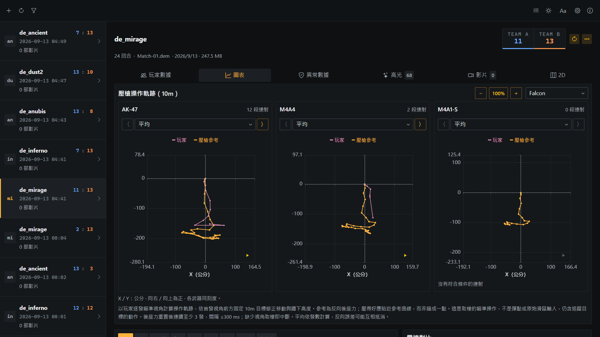
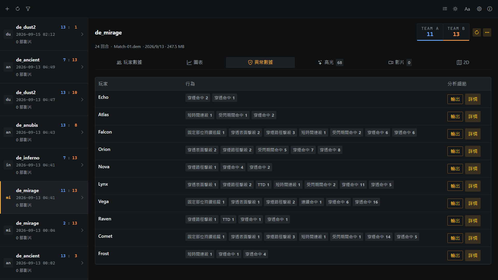
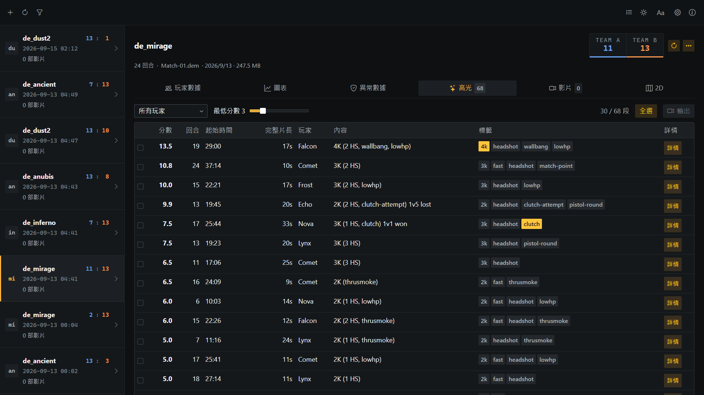
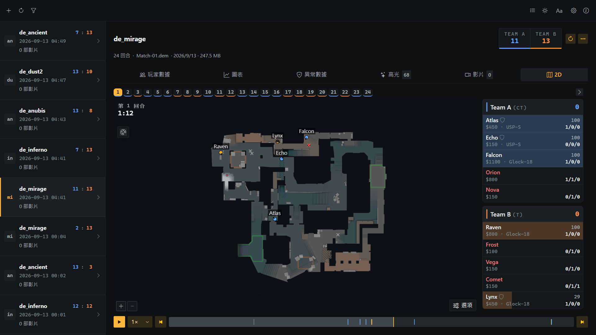

# CS DemoDesk

[English](README.md) | 繁體中文 | [简体中文](README.zh-CN.md) | [日本語](README.ja.md) | [한국어](README.ko.md) | [Русский](README.ru.md)

專為 Counter-Strike 2 打造的 Windows Demo 管理與分析工具：查看玩家統計、2D 回放與實驗性異常數據，並將高光或可疑片段輸出為影片。

## 下載

- **[Microsoft Store](https://apps.microsoft.com/detail/9N5G4VXSDGS5)** — 透過 Microsoft Store 安裝與自動更新。
- **[免安裝 EXE](https://github.com/noih/cs-demodesk/releases/latest)** — 從 GitHub Releases 下載 `.exe`，免安裝。

## 使用須知

- CS2 更新後若無法輸出影片，至設定頁重新下載 HLAE 通常即可恢復。
- 請等待工具下載完成；中途關閉程式或取消下載，可能導致安裝不完整。
- 錄影期間無法同時遊玩；多筆輸出會依序執行。
- 通訊軟體或瀏覽器播放建議選 H.264；NVIDIA 編碼需 NVIDIA 顯示卡。

## 功能

### 比賽統計

整理比賽結果與玩家表現，涵蓋交戰、道具使用與各種回合情境，並透過比較圖表、回合趨勢及壓槍軌跡，從不同角度回顧比賽。



### 異常數據（實驗性）

統計全場玩家的瞄準、射擊與移動行為，查看 TTD、估算穿煙命中率等數據，並依玩家與行為項目選取、合併及輸出可疑片段，方便回看。

統計僅供參考，不是作弊判定；無法識別刻意掩飾且數據無異常的外掛，沒有異常也不代表沒有作弊。



### 高光影片

- 自動偵測並評分高光片段（多殺、clutch、ninja defuse）
- 勾選的片段由背景執行的 CS2 錄製，FFmpeg 編碼
- 解析度、FPS、H.264 / H.265、CPU 或 NVIDIA
- 逐項畫面元素開關，可合併為單一影片
- 檔案大小上限（10 / 20 / 50 MB），便於在通訊軟體分享



### 2D 回放

- 玩家位置、視角、血量、護甲、武器、金錢
- 手榴彈、煙霧 / 火 / 閃光範圍、C4 與拆彈倒數、擊殺訊息、可聽見範圍
- 回合切換、播放速度、跟隨玩家
- 多樓層地圖每層各一面板；雷達圖自本機遊戲檔抽取



## 設計

### 唯讀遊戲檔案

不在遊戲目錄寫入任何 plugin、script 或 cfg，也不修改任何遊戲檔案。錄影透過 [HLAE](https://github.com/advancedfx/advancedfx) 以 `-insecure` 啟動獨立的 CS2 程序（與手動使用 HLAE 相同），經遊戲內建的 netcon 主控台送出指令，並以獨立的 `USRLOCALCSGO` 目錄保存遊戲設定，不影響玩家本身的設定。所有第三方工具皆下載至程式自己的資料目錄：

| 工具 | 用途 | 來源 |
| --- | --- | --- |
| HLAE | 錄影（mirv_streams） | [advancedfx/advancedfx](https://github.com/advancedfx/advancedfx) |
| FFmpeg | 編碼、合併、大小上限 | [BtbN/FFmpeg-Builds](https://github.com/BtbN/FFmpeg-Builds)（GPL） |
| Source 2 Viewer CLI | 自 vpk 抽取雷達圖 | [ValveResourceFormat](https://github.com/ValveResourceFormat/ValveResourceFormat)（MIT） |
| demoparser | 解析 demo（vendored） | [LaihoE/demoparser](https://github.com/LaihoE/demoparser)（MIT） |

### 檔案式儲存

不使用資料庫。設定、輸出工作與分析快取以檔案儲存，預設位於使用者家目錄下的 `%USERPROFILE%\.noih\demodesk-data`，可在設定中變更資料目錄。demo 保留在原始位置，可逐一加入，也可透過掃描資料夾載入。

## 建置

需要 [Rust](https://rustup.rs)（stable）與 Visual Studio Build Tools（使用 C++ 的桌面開發）、Node.js 24.20.0（`.nvmrc`）、WebView2（Windows 內建）。

```powershell
npm install
npm run app:dev      # 開發：Vite + Tauri 視窗
npm run app:build    # dist-portable\CS-DemoDesk-<version>.exe
npm run test:core    # Rust 單元測試
```

## 發版

Release 由 [GitHub Actions](.github/workflows/release.yml) 建置並附 build provenance 證明。驗證下載的檔案確實由本 repo 建置：

```powershell
gh attestation verify CS-DemoDesk-<version>.exe --owner noih
```

## 授權

Copyright (C) 2026 NOIH - <https://github.com/noih>

[GNU AGPL-3.0](LICENSE)。第三方元件依各自授權（見上表；vendored 的 demoparser 保留其 MIT 授權於 `vendor/demoparser/LICENSE`）。
